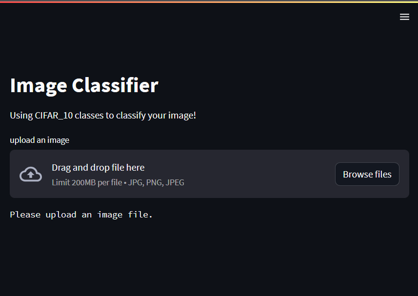
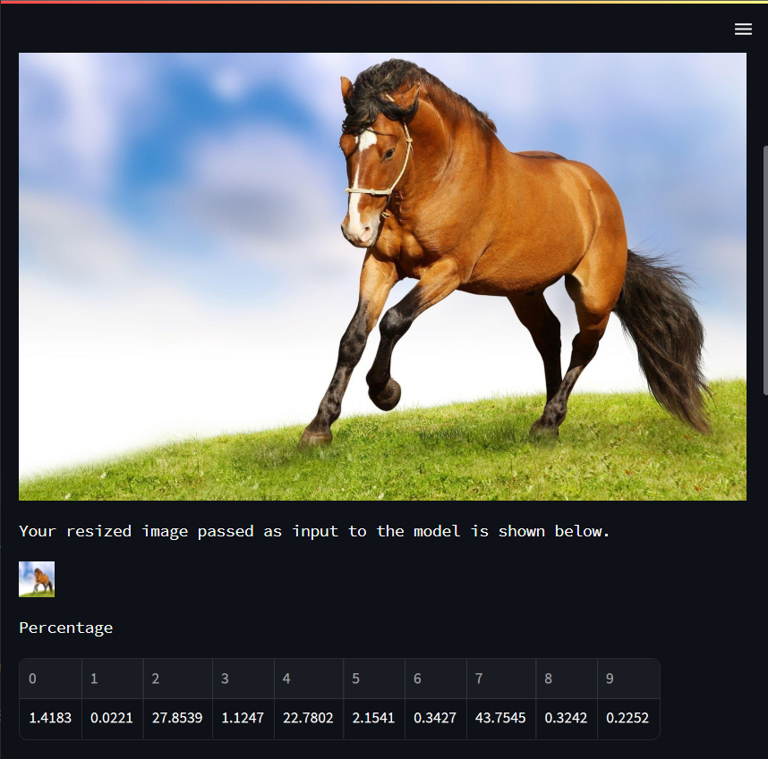
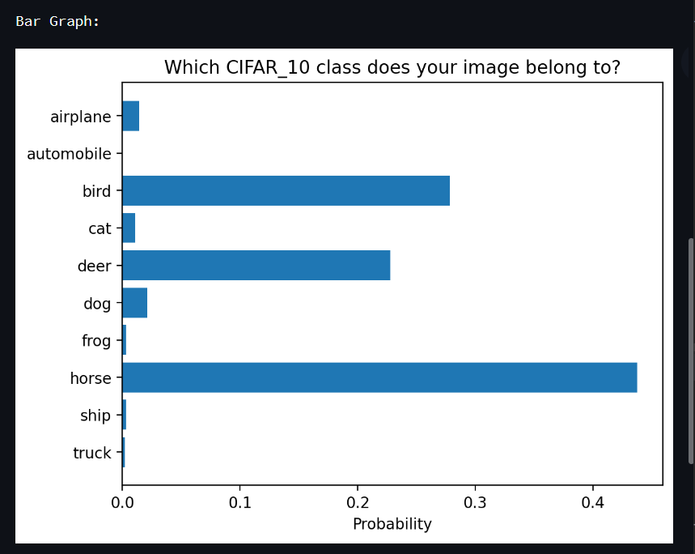
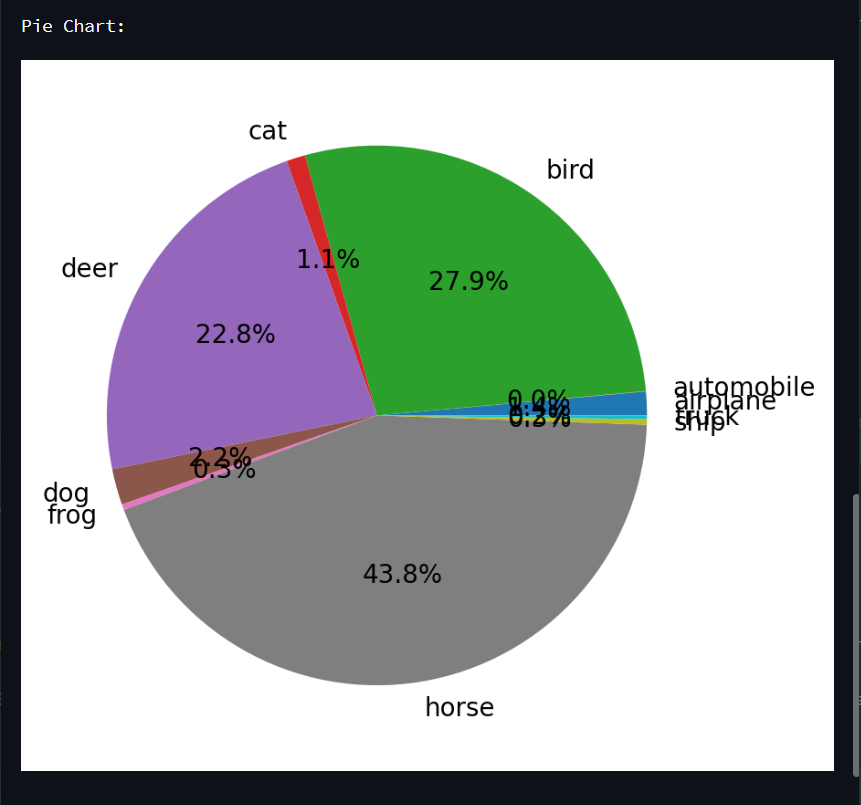

Uses Tenforflow's Keras library.
This ML project is front-end supported (streamlit).

Image can be given as input and will be classified into their own respective categories with the help of CIFAR-10.
The visual representation of classification is done using horizontal bargraph and Piechart.
The CIFAR-10 dataset consists of images classified into 10 categories: airplane, automobile, bird, cat, deer, dog, frog, horse, ship, and truck.

CIFAR-10:
It is a predefined data set which helps in image classification.
It is a well-known benchmark dataset that consists of 60,000 labeled images, specifically designed for image
classification tasks. The CIFAR-10 dataset is widely used in the field of computer vision and serves as a standard
benchmark for evaluating image classification algorithms and models.

Weights in ML:
In neural networks, which are commonly used in deep learning, the weights are associated with the connections between
neurons in different layers. Each connection has a weight assigned to it, and these weights determine the influence of
the input signals on the output of each neuron.
If weight is close to 0, the input won't affect the output much.
If weight is < 0 (negative), the increase in input will decrease the output!

Adam (optimization algorithm):
Adam (short for Adaptive Moment Estimation) is an optimization algorithm commonly used in machine learning, 
particularly for training neural networks. It is an extension of the stochastic gradient descent (SGD) optimization 
algorithm that combines elements of RMSprop and AdaGrad.

